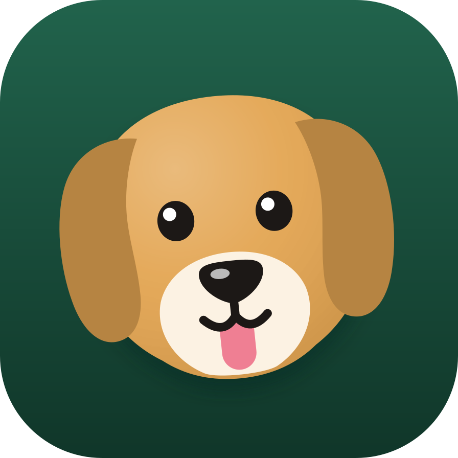

<p align="center"></p>

<h1 align="center">later.dog</h1>

<p align="center">Your dogs, on your Mac. Open source.</p>

later.dog is a desktop home for AI agents that do real work. We call them dogs. Each dog is a contact in your sidebar
with its own computer, browser and files; dogs message each other, run on a schedule, check with you before they act,
and hand big engineering tasks to a cloud workspace that opens verified pull requests. It runs on the subscriptions you
already pay for — ChatGPT, Claude, Grok — through their official sign-in flows, so there are no API keys to paste.

## Install (macOS, Apple silicon)

1. Download `later.dog-macOS-arm64.zip` from the [latest release](https://github.com/woodbeary/later-dog/releases/latest).
2. Unzip and drag **later.dog** into Applications.
3. The first time, **right-click → Open**. Releases are signed with later.dog's own certificate, not Apple's, so macOS
   asks once. Every release carries the same signature, so the keychain access and the Accessibility and Screen
   Recording permissions you grant are meant to carry over to later versions.
4. The welcome tour asks your name, shows which AI providers it found, and lets you **sign in to ChatGPT, Claude or Grok**
   with their device-code or browser flows. Then it makes your first dog.

That is the whole setup. Everything a dog does stays on your Mac unless you connect a cloud workspace (below).

The app does not install updates itself yet. It asks GitHub for the latest release when it opens and every 12 hours,
sending nothing about you, and offers the download when a newer one is out. Settings → General → Check for new
versions turns that off.

## The first five minutes

- **Talk to a dog like a teammate.** It answers, runs commands in its working folder, browses with its own browser, and
  shows screenshots as proof. Keep it on **Heel** and it checks with you before commands and file changes (changes to its own routines, tricks and profile apply at once, with Undo); let it **Off-leash** and it acts,
  then tells you.
- **Pick a breed and a role.** New dog → a breed (retriever, beagle, shepherd, corgi, husky, pug, poodle, chihuahua), a
  color, and a starting role: chief of staff, engineer, nightly audit engineer, reviewer, project manager, inbox manager,
  intel scout, gatekeeper — job descriptions distilled from how people actually run agent teams
  ([playbook](docs/laterdog/bot-playbook.md)).
- **Teach it tricks.** A trick is a skill: a playbook the dog follows when asked.
- **Send it to fetch.** The Fetch chip (or `/goal`) gives a dog something to keep working on until it is done.
- **Run a pack.** A group chat with a roster; @-mention one dog and it can consult another and relay the answer.
- **Put it on a clock.** Ask a dog to make itself a routine; you confirm the schedule once and it runs in its own thread.
- **Switch models any time.** Codex on your ChatGPT plan, Claude Code, Grok — per dog or per conversation, with the
  reasoning effort you want.
- **Never run dry.** Sign in to several Claude accounts and several ChatGPT (Codex) accounts in Settings → General →
  Accounts and switch on Keep going when an account runs out. When one hits its usage limit, the conversation continues
  on your next account of the same engine and comes back when the limit resets; when every account is out, it waits and
  picks up where it stopped ([how it works](docs/laterdog/token-battery.md)).
- **Give a treat.** The bone under a dog's reply makes it happy and counts on its profile. It does nothing else.

## Cloud work: tasks in, verified pull requests out

Open **Workspace** in the sidebar, connect a repository, and delegate a task from chat. The supervisor submits it to
Codex Cloud (your plan) or a Claude Code routine, collects the diff, publishes a **draft PR** from an isolated checkout,
verifies at the exact commit with your real CI checks, runs an independent review in a separate session, and turns your
corrections into repair runs on the same PR. Nothing merges by itself.

The supervisor is a small service you host yourself. The documented path is a Cloudflare Worker + container that sleeps
when idle ([runbook and budget](docs/laterdog/cloudflare.md)); plain Docker works too
([deployment](docs/laterdog/deployment.md)). The desktop finds it through `~/.laterdog/supervisor.json`.

## Send your agent

Most people will not set this up by hand. Point your coding agent (Codex, Claude Code, Cursor, …) at this repository and
say *"clone later.dog and set it up for me"*. It will find:

- [`AGENTS.md`](AGENTS.md) — the rules of this repo.
- [`skills/laterdog/setup-laterdog/SKILL.md`](skills/laterdog/setup-laterdog/SKILL.md) — the setup procedure, including
  the four things only you can do (sign in to your providers, grant macOS permissions, authorize the GitHub device code
  that Workspace → Connect GitHub shows, so the supervisor can open pull requests as you).
- [`llms.txt`](llms.txt) — an index of every document that matters.

## Support later.dog, and the dogs

later.dog is free and open source and stays that way. Sponsorships keep it maintained, and a share of every one goes to
animal rescue — the amounts and recipients are published in [docs/laterdog/support.md](docs/laterdog/support.md), and
nothing in the app nags you about it. Pull requests are welcome too: [CONTRIBUTING.md](CONTRIBUTING.md) says what a
mergeable one looks like (proof over promises).

## Build from source

```sh
git clone https://github.com/woodbeary/later-dog.git && cd later-dog
pnpm install --frozen-lockfile        # Node 24 and pnpm 10.33
pnpm laterdog:package                 # unsigned local build → release/mac-arm64/later.dog.app
ditto release/mac-arm64/later.dog.app /Applications/later.dog.app && open -a later.dog
```

`pnpm laterdog:dev` runs the same app as a browser page for development (`http://127.0.0.1:5299`).

## What is proven, and what is not

Every claim above was exercised against real providers and recorded with screenshots:
[desktop audit](docs/laterdog/ui-audit-2026-10-06.md), [hosted supervisor record](docs/laterdog/acceptance-2026-10-06.md),
[fixture map](docs/laterdog/verification.md). The first live round trip through the hosted supervisor is recorded in
[acceptance-2026-10-08.md](docs/laterdog/acceptance-2026-10-08.md): four draft PRs on two real repositories, three verified at
their head by the repositories' own CI, a review and corrections on the same PR, and a restart mid-run with nothing
lost or duplicated. Still open: the token battery is proven against fake
Claude and Codex CLIs, not yet against two real accounts at their limits; connected apps (Gmail, Slack, …) need a self-hosted
Composio broker; local computer control needs macOS permission grants; voice dictation needs a signed build.

## Where it is going

later.dog is its own project: it no longer tracks or merges from the project it started from. The direction, in order
(details and status in the [roadmap](docs/laterdog/roadmap.md)):

1. **Its own repository and code.** The history starts here, in one commit. The code it started from (see NOTICE) is
   replaced module by module.
2. **A cloud computer per dog on your own Cloudflare account**, with a live desktop you can watch and take over, asleep
   when idle. Works: `cd deploy/laterdog/computers && pnpm run setup` deploys it to the Cloudflare account wrangler is
   signed in to and points later.dog at it ([details and measured timings](deploy/laterdog/computers/README.md)). Boat,
   a paid cloud-computer service, stays an option.
3. **Any model through Cloudflare AI Gateway** on your own account, next to the Claude, Codex and Cursor subscriptions.
   Planned.
4. **Everything deployable to your own Cloudflare with one command.** Planned.

## Project layout

| Path | What |
| --- | --- |
| `server/laterdog/` | SQLite supervisor: jobs, publishing, verification, review, repair; the token battery; the `laterdog` MCP tools every dog gets |
| `deploy/laterdog/` | Supervisor container, entrypoint with R2 restore/backup, Cloudflare Worker |
| `skills/laterdog/` | Canonical skills, exported by `pnpm laterdog:skills` to Codex, Cursor and Claude Code |
| `docs/laterdog/` | Deployment, Cloudflare, verification, playbook, roadmap, audit records |
| `src/`, `server/`, `electron/` | The desktop app |

## Verification

CI runs `pnpm lint`, `pnpm typecheck`, `pnpm laterdog:test` and `pnpm build`, the whole vitest suite in four shards,
the broker and Electron tests, a supervisor container smoke test and a dry-run deploy of the Cloudflare Worker. [docs/laterdog/verification.md](docs/laterdog/verification.md) says what each fixture proves. Fixture success
never qualifies a live provider; live records live next to the fixtures.

## License

Apache-2.0. See [LICENSE](LICENSE) and [NOTICE](NOTICE).
