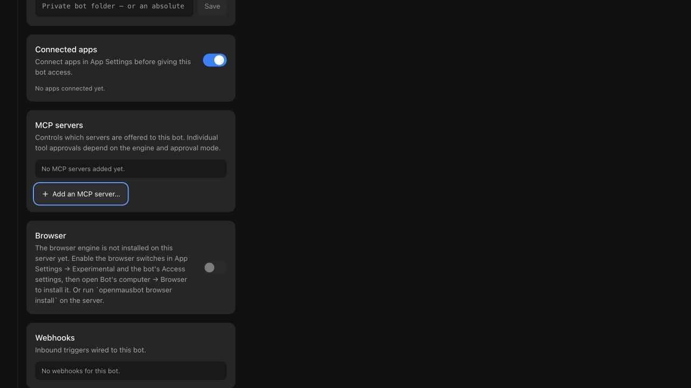
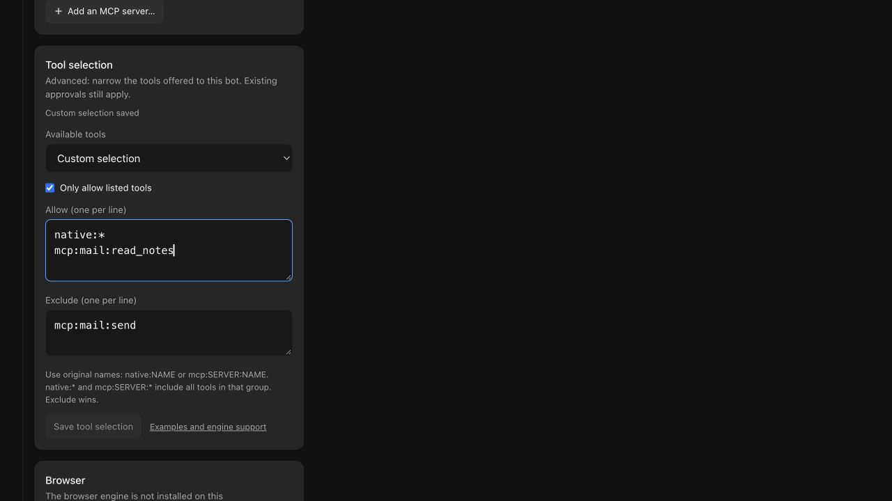

# Per-bot tool selection

All checks below use disposable homes, workspaces and MCP servers. They do
not read the user's later.dog data or connect a real mail account.

## Repeatable automated checks

```sh
pnpm exec vitest run shared/tool-scope.test.ts server/mcp-gate.test.ts server/mcp-gate-config.test.ts server/mcp-remote-proxy.test.ts
pnpm exec vitest run server/store.test.ts server/tool-scope.e2e.test.ts server/drivers/tool-scope-coverage.test.ts server/drivers/acp/tool-scope.test.ts
pnpm exec vitest run server/drivers/pi.test.ts server/drivers/pi-mcp-extension.test.ts server/drivers/chat-mcp-tools.test.ts server/drivers/openai-chat.test.ts server/openai-tools.e2e.test.ts
pnpm exec vitest run src/components/bot-settings/AccessSection.test.ts src/state/store.test.ts src/lib/create-configured-bot.test.ts src/lib/bot-creation-draft.test.ts
LATERDOG_UI_E2E=1 pnpm exec vitest run scripts/testing/tool-selection-ui.e2e.test.ts
```

The UI check opens the actual bot settings and saves, clears, rejects invalid
input, retries a failed save, switches bots during a pending save, checks busy
state, and duplicates a restricted bot atomically. It uses the shared
verification launcher and the real renderer. These are workflow checks with
a fake engine, not live-model planning checks.




The gate checks cover stdio, HTTP and SSE discovery and execution, pagination,
original names, malformed settings/protocol input, credential-safe errors,
zero result budgets and source-free packaged helpers. Adapter checks cover
fresh and resumed policy, approval modes, instance restrictions, unsupported
engines and refusal before prompting. An excluded tool must be absent from
the provider's definitions **and** absent from the fixture's execution log.

Persistence checks inject failed saves and interrupt actual API creation after
its first record. Wider tool access becomes live only after a successful save;
runtime revocations still take effect if persistence fails. Explicit selections
and inherited defaults are present in the first durable bot record, so an
interrupted creation cannot restart with an unrestricted catalog.

A corrupt saved selection refuses a direct send with HTTP 409 before appending
the message or preparing a computer. The isolated API regression also verifies
the transcript is unchanged and no provider is launched.

## Official CLI contract checks

Install the official Pi CLI into a disposable prefix, then supply its absolute
path. The scripts configure their own loopback synthetic provider:

```sh
node --experimental-strip-types scripts/verify-pi-tool-scope.ts /absolute/path/to/pi
node --experimental-strip-types scripts/verify-tool-scope.ts /absolute/path/to/grok
pnpm build:server
node --experimental-strip-types scripts/verify-pi-tool-scope.ts /absolute/path/to/pi dist-server/drivers/pi-mcp-extension.ts
```

Verified contracts: **Pi 0.99.1**, **Grok 1.0.41**. Pi checks late package tool
activation as well as native/custom tools. Grok checks inherited profiles,
model-specific harness changes, resumed selections, explicit MCP helpers,
managed gateway suppression and refusal of unexpected native MCP servers.
These scripts intentionally request withheld tools through the synthetic
provider and check that they never execute. They do not benchmark a model.

Grok's restricted profile is established on the requested model, with the
default harness pinned before spawn. The session must acknowledge the selected
model before prompting; a redundant model switch must not restore tools or
reject an otherwise valid resumed profile. Unknown inherited harnesses and unverified native-selection
runtime versions refuse the turn. The official CLI probe also checks commented
agent headings and refusal of quoted/dotted syntax. Unit checks cover inline
tables, CLI overrides and ambiguous profiles. Codex's real gate subprocess
regression exercises two servers on new/resumed threads, raw discovery and
calls, blocked calls, independent custom approvals, and private env stripping.

The October 1 review follow-up also exercised actual native shell commands
through Codex **0.156.1** and **0.159.2**, using a loopback synthetic Responses
provider and disposable homes on the same physical Mac. Ask, Custom and Full
each passed on both new and resumed threads. The command's receipt confirmed
that private gate settings and an existing excluded fixture variable were
absent, while a configured harmless variable remained available. Scoped turns
disable inherited shell snapshots because snapshots can restore variables
after environment filtering. If that override cannot be confirmed, or the
effective exclusion policy is malformed, no prompt is sent. These checks used
no real Codex account or paid model.

## Real local-model check

Load a tool-capable local model separately with an **8192-token context**, one
parallel request, and an explicit temporary identifier. Confirm those values
with the runtime's loaded-model report, then run Pi and Grok sequentially:

```sh
node --experimental-strip-types scripts/verify-local-tool-selection.ts pi /absolute/path/to/pi http://127.0.0.1:1234/v1 MODEL_ID
node --experimental-strip-types scripts/verify-local-tool-selection.ts grok /absolute/path/to/grok http://127.0.0.1:1234/v1 MODEL_ID
```

The proxy forwards actual model responses and unmodified tool schemas. It
caps generation at 768 tokens and each turn at 12 requests. It captures schema
names/bytes and provider-reported usage, waits for response evidence, and
checks the file and MCP execution receipts. Unload only the test model when
finished; leave other projects and the local-model service running.

### Physical Mac evidence, 2026-09-30

Executed on arm64 macOS **26.6.2 (25G83)**, **24 GiB RAM**. Runtime: LM Studio
CLI commit `1017bcb`, llama.cpp Metal backend **2.48.0**. Model:
`lmstudio-community/Qwen3.5-2B-GGUF`, **Q4_K_M**, repository revision
`bb84e11355a036e28f080c7793fa6d22b7c4e344`. File SHA-256:
`0bfe35afc9f05b7fac3fa04925e051ac7939a42a8a17ea11afc99701bea826cc`.
The loaded-model report confirmed 8192 context and one parallel request.

| Real turn | Pi schemas / JSON bytes | Grok schemas / JSON bytes | Execution evidence |
| --- | --- | --- | --- |
| Drafting | 3 / 2297 | 3 / 3516 | Actual model wrote the requested disposable file |
| Selected mail read | 1 / 182 | 2 native helpers / 2840 | Only `read_notes` appears in the MCP receipt |
| Explicit no tools | 0 / 2 | 0 / 2 | No terminal marker and no additional MCP call |

Grok separately sends a session-title request (one schema, 388 bytes), which
is excluded from main-turn counts. Its synthetic default-catalog comparison
was 25 schemas / 44415 bytes; the live drafting turn's reduced catalog was
3 / 3516. This is not a reconstruction of the original issue's 97-tool setup.

The final successful Pi and Grok mail turns each made two allowed read calls. Grok
was rerun after the inherited-profile and Codex gate review fixes; Pi's
implementation was unchanged from its accepted live run. An
earlier small-model run exceeded the request budget and failed. The passing
checks establish tool availability and execution boundaries, not one-call
planning quality or general model reliability.

Provider-reported usage is summed across each turn's main requests, including
reasoning in completion tokens. Grok's auxiliary title usage was not supplied.
These totals are not a per-request context size or a monetary saving estimate.

| Engine / turn | Main requests | Prompt tokens, summed | Completion tokens, summed |
| --- | --- | --- | --- |
| Pi drafting | 2 | 3374 | 229 |
| Pi mail | 2 | 1748 | 307 |
| Pi no tools | 1 | 608 | 123 |
| Grok drafting | 3 | 9444 | 266 |
| Grok mail | 5 | 14748 | 493 |
| Grok no tools | 2 | 4240 | 426 |

The largest individual prompt was 1819 tokens for Pi and 3434 for Grok.
The fixture answered two Pi and three Grok approval requests for its own
disposable operations. No real account, desktop or other project was involved.

Whole-machine snapshots during these checks reported 24%, 22% and 31% free
memory, and respectively 47716.50, 47760.12 and 46146.38 MiB of swap in use.
The loaded model worker's sampled RSS was 1242208 KiB. Other applications and
test devices remained running. These are point samples, not isolated peak
memory or a causal performance comparison. The test model was unloaded and
the disposable agent data removed afterward.

## Required repository checks and limits

Run `pnpm typecheck`, `pnpm lint`, `pnpm test`, `pnpm check:electron` and
`pnpm i18n:check`. On a Mac with Node installed outside standard locations,
the installer tests' fake PATH may not find Node. A temporary link to Node
in pnpm's existing `node_modules/.bin` can supply it through `LATERDOG_EXTRA_PATH`.
First verify that directory contains no npm executable, so the fixture's fake
npm remains selected. Use the same leading directory in the test process's
inherited PATH; the PATH contract test intentionally checks that order.
Remove only the link created for this test afterward. Do not prepend a real
npm installation or change application code to repair the machine's PATH.

### Completed contribution checks

`pnpm typecheck`, `pnpm lint`, `pnpm check:electron` (145 modules), and
`pnpm i18n:check` (10 languages) passed. One final review found two material
issues; failing regressions reproduced them before the fixes. The final affected
checks passed 349 tests. A later test-only Windows teardown correction passed
another 35 tests in the ACP selection and Pi extension suites.

The complete local `pnpm test` chain passed on composed verification commit
`4f66f395ef27da4dd93c2828dc17db9220bf62ef`: Vitest 10578 passed, 70 skipped and
1 todo (801 files passed, 25 skipped); broker 10 passed; Electron 513 passed,
3 existing skips; all five source-free packaged-server checks passed, including
all 13 spawned proxy paths. Optional browser fixtures absent from the managed
checkout are not counted as tested. The actual tool-selection renderer workflow
and the screenshots above were verified separately in the primary checkout.

The final composed CI run, in the contributor's own repository,
on `738c5a8a586b6922b28a32947a06c05ba12abe62` passed all 26 selected checks,
including all 12 Vitest shards across macOS, Ubuntu and Windows, builds,
renderer, Electron and source-free packaging checks. Deployment was deliberately
skipped. Its tree differs from feature commit
`299dc1994fc6f0fc073d7a6f826d4e180b7738be` only in two CI prerequisite test
files. The new ACP selection, Pi extension and capacity cleanup suites passed
on Windows without a cleanup warning. The existing ACP suite's temporary-home
cleanup warning also occurs in the unchanged-production baseline.

The feature draft keeps those prerequisites out of its diff. A maintainer
preflight repair and a Windows cleanup draft had to land before the clean
feature branch could have green CI. The cleanup candidate's exact-head full CI
also passed all 26 checks; its one unchanged network-fixture failure and focused
rerun were disclosed in that pull request. That run and those pull requests
predate later.dog's own repository, and their links were removed on 2026-10-08.
The composed green result is not a claim of green CI on the clean feature head.

The [engine support table](../tool-selection.md#engine-support) distinguishes
usable native selection from MCP-only support and fail-closed unsupported
restrictions. Other native CLI contracts, a full Electron package smoke,
real connected accounts, other local models and other macOS versions are
not established by this verification. The full repository suite and CI
results belong in the pull request's validation record.
